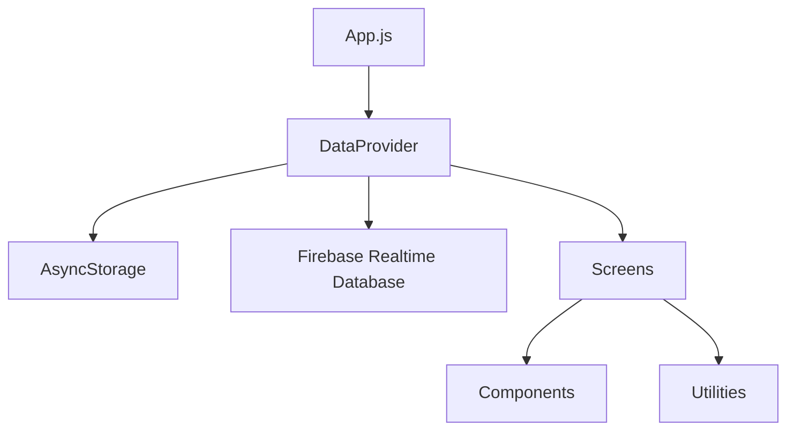

# Shopiii - Architecture & Code Organization

This document describes how Shopiii is structured, how data flows through the app, and where the main responsibilities live.

## Repository Layout

```
shopiii/
├── App.js
├── app.json
├── package.json
├── README.md
├── QUICKSTART.md
└── doc/
    ├── ARCHITECTURE.md
    ├── DATA_MODEL.md
    ├── FEATURES.md
    ├── FIREBASE.md
    ├── SETUP.md
    └── TROUBLESHOOTING.md

src/
├── components/
├── config/
├── context/
├── screens/
└── utils/
```

## Runtime Architecture

1. `App.js` creates the navigation tree and wraps the app in `DataProvider`.
2. `DataProvider` owns local state, persistence, and cloud sync.
3. Screens read and update shared state through `DataContext`.
4. Utilities keep formatting and date logic separate from UI.

### Data Flow



## Navigation Structure

`App.js` defines:

- A root stack navigator
- A bottom tab navigator with these screens:
  - Home
  - Daily Book
  - Products
  - History
  - Dashboard
  - Settings

The app uses a custom floating tab bar and `MaterialCommunityIcons` for navigation icons.

## State Management

`src/context/DataContext.js` is the primary state layer.

### It manages:

- Daily entries
- Product price catalog
- Shop details
- Selected date
- Loading state
- Sync metadata
- Firebase sync messages

### It provides actions such as:

- `addEntry()`
- `updateEntry()`
- `deleteEntry()`
- `togglePaymentStatus()`
- `upsertProductPrice()`
- `deleteProductPrice()`
- `updateShopDetails()`
- `changeDate()`
- `uploadToFirebase()`
- `fetchFromFirebase()`

## Persistence Strategy

### Local storage

The app stores user data in AsyncStorage so it works offline.

Common keys include:

- `shopDetails`
- `product_prices`
- `entries_YYYY-MM-DD`
- `syncMetadata`

### Cloud sync

Firebase Realtime Database is optional.

Current sync behavior:

- Attempts anonymous auth if available
- Surfaces auth/rules failures in the Home sync card
- Can still be used for development setups with relaxed rules

## Screen Responsibilities

### Home

- Shop summary cards
- Daily/monthly/yearly metrics
- Sync status card

### Daily Book

- Add, edit, and delete entries
- Toggle collected/pending payment status
- Show totals header

### Products

- Manage product price list
- Link products to barcodes
- Use camera scanning on mobile devices

### History

- Browse entries for a chosen date
- Read-only historical view

### Dashboard

- 30-day trend charts
- Yearly profit chart
- Analytics summaries

### Settings

- Edit shop profile details
- Review app/data configuration
- Access product and sync settings

## Data Structure Notes

See [DATA_MODEL.md](DATA_MODEL.md) for the full schema.

## Dependencies

- Expo 54
- React Native 0.81
- React Navigation 7
- AsyncStorage
- Firebase
- react-native-chart-kit
- react-native-svg
- expo-camera
- @react-native-community/datetimepicker

## Related Docs

- [Project setup](SETUP.md)
- [Feature guide](FEATURES.md)
- [Firebase guide](FIREBASE.md)
- [Troubleshooting](TROUBLESHOOTING.md)

### Integration Testing
- Navigation flow
- Data persistence (AsyncStorage)
- Form submission workflow

### E2E Testing
- Complete user journey
- Transaction lifecycle
- Analytics calculations

## Deployment Checklist

- [ ] App version updated in app.json
- [ ] Shop details configured
- [ ] Test on Android device
- [ ] Test on iOS device
- [ ] Test on web browser
- [ ] Verify all data persistence
- [ ] Review analytics calculations
- [ ] Check edge cases (no data, large datasets)

## Performance Optimizations

### Implemented
- FlatList for efficient list rendering
- Context-based state avoids prop drilling
- StyleSheet for optimized styles
- AsyncStorage querying by date

### Potential Future
- Pagination for large datasets
- Memoization of components
- Lazy loading of screens
- Caching of analytics calculations

## Future Architecture Changes

### Phase 2 (Cloud Sync)
- Firebase Firestore integration
- Multi-device synchronization
- User authentication

### Phase 3 (Enhanced Features)
- Inventory management
- Customer relationship tracking
- SMS notifications
- PDF generation

### Phase 4 (Business Intelligence)
- Advanced analytics
- Forecasting
- Tax calculation helpers
- Multi-location support

---

**Architecture Version**: 1.0
**Last Updated**: April 2026
**Status**: Production Ready
